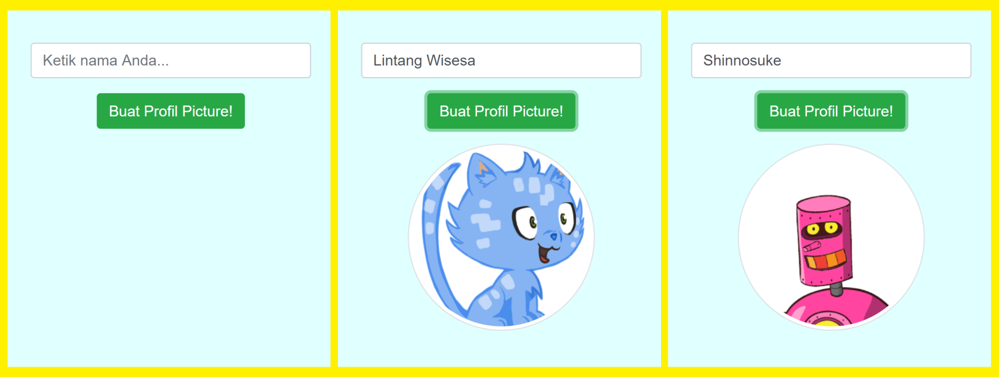

# Soal Ujian Web Developer Elisoft Technology

Silahkan kerjakan beberapa soal dibawah menggunakan Framework PHP Laravel ataupun menggunakan Laravel Vue Js menambah nilai plus.
> Jika selesai mengerjakan silahkan push ke github/gitlab Private dengan format test_webdev_elisoft_NamaAnda. Lalu undang username berikut
reiulen, elisofttech. Terima kasih

#
### **Soal 1 - Profile Picture Generator**

Buat sebuah page yang dapat men-generate gambar avatar, dengan memanfaatkan layanan *__Robohash__* [(https://robohash.org/)](https://robohash.org/). Robohash merupakan layanan web untuk menampilkan gambar acak (robot, monster, alien atau kucing) berdasarkan input teks.

Alur kerjanya sederhana: user dapat memasukkan random teks ke dalam textbox input, kemudian gambar avatar akan muncul usai user menekan tombol.



>_***Gunakan Request Fetch API di controller***._


### **Soal 2 - API User**
Buatlah sebuah table menggunakan migration dengan skema table berikut :
```bash
id (uuid) Primary Key (Gunakan UUID untuk ID user)
name (varchar)
email (varchar)
password (varchar) HASH
status (enum) 1 Aktif 2 Nonaktif
created_at (timestamp)
updated_at (timestamp)
deleted_at (timestamp) (Gunakan Soft Delete)

```
Siapkan user dengan ***Database Seeder***
```
email : elisofttech@test.com
password : 12345678
```


### **Soal 3 - Authentication**
Buatlah sebuah fungsi login menggunakan jquery ajax / library axios (jika menggunakan vue bisa di sesuaikan).

#### **Login**
User login jika email dan password salah akan manampilkan alert __*Email atau Password tidak ditemukan*__ .
Jika benar sama akan menampilkan alert __*Login Sukses*__ lalu berikan setelah 2 detik akan otomatis diarahkan ke halaman dashboard.
#### **Logout**
Ketika user mengklik tombol logout, user akan mendapatkan alert yakin atau tidak logout. Jika yakin user akan diarahkan kembali ke halaman login setelah 2 detik.

### **Soal 4 - CRUD**
- Buatlah sebuah list data user menggunakan library **Laravel DataTable Server Side**
[(https://yajrabox.com/docs/laravel-datatables/10.0)](https://yajrabox.com/docs/laravel-datatables/10.0) (Jika menggunakan vue bisa menggunakan Vue Good Table Serveside) gunakan fungsi **Serveside**. Buatlah sebuah filter data
Status User, dan range tanggal user dibuat.
- Buatlah sebuah fungsi Create, Read, Update, Delete menggunakan jquery ajax (Vue Bisa menyesuaikan). List data berubah sesuai proses tanpa refresh

### **Soal 5 - Logika Nested Menu (Menu bertingkat)**
Berikut sample data yang ada
```
$menus = [
    ['id' => 1, 'nama' => 'Menu 1', 'parent_id' => 0],
    ['id' => 2, 'nama' => 'Menu 1.1', 'parent_id' => 1],
    ['id' => 3, 'nama' => 'Menu 1.2', 'parent_id' => 1],
    ['id' => 4, 'nama' => 'Menu 2', 'parent_id' => 0],
    ['id' => 5, 'nama' => 'Menu 2.1', 'parent_id' => 4],
    ['id' => 6, 'nama' => 'Menu 2.2', 'parent_id' => 4],
    ['id' => 7, 'nama' => 'Menu 2.1.1', 'parent_id' => 5],
    ['id' => 8, 'nama' => 'Menu 3', 'parent_id' => 0],
];
```
Tugasnya adalah membuat fungsi untuk menghasilkan output menu dalam bentuk hierarki yang tepat.
Contoh output yang diharapkan
```
- Menu 1
  - Menu 1.1
  - Menu 1.2
- Menu 2
  - Menu 2.1
    - Menu 2.1.1
  - Menu 2.2
- Menu 3
```

